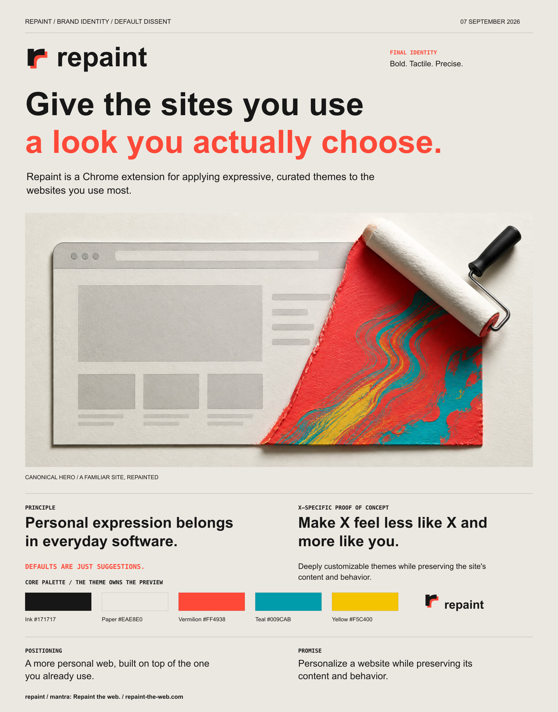

# Personal Skills

Reusable skills for AI coding agents.

## Midjourney Images

[](https://skills.sh/transitive-bullshit/skills)

[`midjourney-images`](skills/midjourney-images/SKILL.md) writes focused Midjourney prompts and can create images in the Midjourney web app. Use it to explore a visual style, build a brand world, or develop concept art.

<p align="center">
  
  
</p>

The skill supports two tasks:

- **Prompt only:** Write or improve a prompt without opening Midjourney.
- **Create on web:** Submit one standard image batch and report the result.

Install it with the Skills CLI:

```sh
npx skills add transitive-bullshit/skills --skill midjourney-images
```

## Branding Exercise

[](https://skills.sh/transitive-bullshit/skills)

[`branding-exercise`](skills/branding-exercise/SKILL.md) develops a project brand through a short context interview, distinct visual identity directions, and iteration. Use it to create a new brand identity or intentionally rebrand an existing project.

<p align="center">
  
</p>

The skill produces:

- **Visual directions:** At least three distinct brand concepts with one-page posters to compare and refine.
- **Accepted identity:** A brand guide, reusable logo and imagery assets, favicons, a social image, and a reproducible one-page poster.
- **Project guidance:** A pointer in the project's agent instructions so future customer-facing work follows the accepted identity.

Install it with the Skills CLI:

```sh
npx skills add transitive-bullshit/skills --skill branding-exercise
```

## Keep local skills in sync

Run this command from the repository:

```sh
pnpm link:skills
```

It links each repository skill to `~/.agents/skills`. Edits made through either path appear as changes in this repository. The command stops if a regular file or directory already uses a skill name.

## License

[MIT](license) by [Travis Fischer](https://x.com/transitive_bs).
