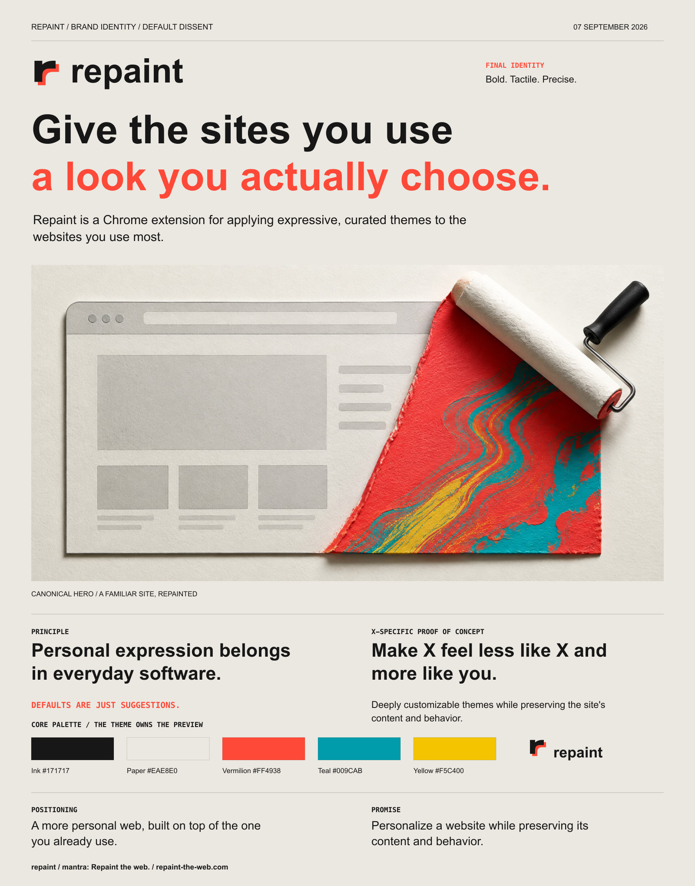
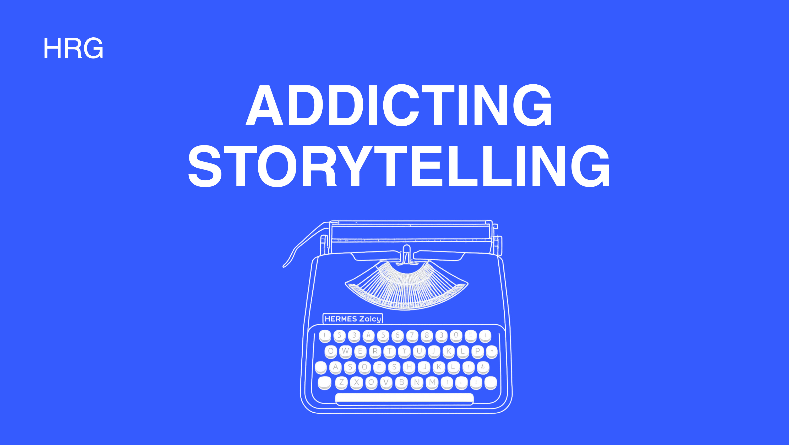

# Personal Skills

Reusable skills for AI coding agents.

## Midjourney Images

[](https://skills.sh/transitive-bullshit/skills)

[`midjourney-images`](skills/midjourney-images/SKILL.md) writes focused Midjourney prompts and can create images in the Midjourney web app. Use it to explore a visual style, build a brand world, or develop concept art.

<p align="center">
  
  
</p>

The skill supports two tasks:

- **Prompt only:** Write or improve a prompt without opening Midjourney.
- **Create on web:** Submit one standard image batch and report the result.

Install it with the Skills CLI:

```sh
npx skills add transitive-bullshit/skills --skill midjourney-images
```

## Branding Exercise

[](https://skills.sh/transitive-bullshit/skills)

[`branding-exercise`](skills/branding-exercise/SKILL.md) develops a project brand through a short context interview, distinct visual identity directions, and iteration. Use it to create a new brand identity or intentionally rebrand an existing project.

<p align="center">
  
</p>

The skill produces:

- **Visual directions:** At least three distinct brand concepts with one-page posters to compare and refine.
- **Accepted identity:** A brand guide, reusable logo and imagery assets, favicons, a social image, and a reproducible one-page poster.
- **Project guidance:** A pointer in the project's agent instructions so future customer-facing work follows the accepted identity.

Install it with the Skills CLI:

```sh
npx skills add transitive-bullshit/skills --skill branding-exercise
```

## Storytelling

[](https://skills.sh/transitive-bullshit/skills)

[`storytelling`](skills/storytelling/SKILL.md) creates and critiques marketing narratives, product or project pitches, and personal stories. Use it to sharpen a hook, clarify emotional stakes, connect story beats, or make an ending land.

This skill is based on work by [Edmund Tian](https://www.instagram.com/edmund.tian).

<p align="center">
  
</p>

The skill supports two tasks:

- **Create:** Draft a narrative around a clear message, causal story beats, and a memorable payoff while preserving your voice and grounding claims in supplied facts.
- **Critique:** Identify the changes that most improve clarity, stakes, credibility, or payoff, with concrete revisions to weak passages.

Install it with the Skills CLI:

```sh
npx skills add transitive-bullshit/skills --skill storytelling
```

## Personal workflows

[`social-posting`](skills/social-posting/SKILL.md) and [`x-mirror`](skills/x-mirror/SKILL.md) are my own social posting setup: launch game plans and scheduled posts across Threads, Bluesky, LinkedIn, Instagram and TikTok through [Postiz](https://postiz.com), using my X posts as the guide. They're wired to my accounts, so they're here as a reference rather than for installing as-is.

Two more follow my own conventions: [`init-git-repo`](skills/init-git-repo/SKILL.md) sets up a clean, shareable repo the way I like it (audit, baseline files, my TypeScript tooling, docs), and [`personal-notion-projects`](skills/personal-notion-projects/SKILL.md) drafts project write-ups in the Notion CMS behind my site.

## Keep local skills in sync

For a shared setup across Codex and Claude, give your agent this prompt:

```text
Set up transitive-bullshit/skills for my coding agents. Read AGENTS.md,
inspect existing skills, and use the mac profile for a fresh installation.
Preserve existing profiles and local edits, review conflicts before adopting
them, and finish with the doctor check.
```

From the repository, with Python 3.11+:

```sh
python3 scripts/skillset.py apply
python3 scripts/skillset.py doctor
```

This reuses your installed profile (or defaults to `mac`) and symlinks skills into `~/.agents/skills` and `~/.claude/skills`. Edits through either path are Git changes here. Commit and push normally; pull and apply on other machines. Existing files are preserved; conflicts stop installation.

See [setup notes](docs/setup.md) for profiles and adoption, or the [dotfiles repo](https://github.com/transitive-bullshit/dotfiles) for full environment setup and `agent-env` synchronization.

## Other installed skills

I also keep these 47 third-party skills in this checkout. Links point to their original sources; [skills.json](skills.json) records provenance and profile membership.

- [cloudflare/security-audit-skill](https://github.com/cloudflare/security-audit-skill): [`security-audit`](https://github.com/cloudflare/security-audit-skill/blob/main/skills/security-audit/SKILL.md).
- [cloudflare/skills](https://github.com/cloudflare/skills): [`web-perf`](https://github.com/cloudflare/skills/blob/main/skills/web-perf/SKILL.md).
- [cursor/plugins](https://github.com/cursor/plugins): [`unslop`](https://github.com/cursor/plugins/blob/main/pstack/skills/unslop/SKILL.md).
- [dzhng/skills](https://github.com/dzhng/skills): [`auto-research`](https://github.com/dzhng/skills/blob/main/skills/engineering/auto-research/SKILL.md).
- [emilkowalski/skills](https://github.com/emilkowalski/skills): [`animation-vocabulary`](https://github.com/emilkowalski/skills/blob/main/skills/animation-vocabulary/SKILL.md), [`find-animation-opportunities`](https://github.com/emilkowalski/skills/blob/main/skills/find-animation-opportunities/SKILL.md), [`improve-animations`](https://github.com/emilkowalski/skills/blob/main/skills/improve-animations/SKILL.md), [`prototype`](https://github.com/emilkowalski/skills/blob/main/skills/prototype/SKILL.md), [`review-animations`](https://github.com/emilkowalski/skills/blob/main/skills/review-animations/SKILL.md).
- [gitroomhq/postiz-agent](https://github.com/gitroomhq/postiz-agent): [`postiz`](https://github.com/gitroomhq/postiz-agent/blob/main/SKILL.md).
- [humanlayer/skills](https://github.com/humanlayer/skills): [`show-me`](https://github.com/humanlayer/skills/blob/main/plugins/show-me/skills/show-me/SKILL.md).
- [ibelick/ui-skills](https://github.com/ibelick/ui-skills): [`improve-ui`](https://github.com/ibelick/ui-skills/blob/main/skills/improve-ui/SKILL.md).
- [jakubkrehel/skills](https://github.com/jakubkrehel/skills): [`better-accessibility`](https://github.com/jakubkrehel/skills/blob/main/skills/better-accessibility/SKILL.md), [`better-colors`](https://github.com/jakubkrehel/skills/blob/main/skills/better-colors/SKILL.md), [`better-layout`](https://github.com/jakubkrehel/skills/blob/main/skills/better-layout/SKILL.md), [`better-typography`](https://github.com/jakubkrehel/skills/blob/main/skills/better-typography/SKILL.md), [`better-ui`](https://github.com/jakubkrehel/skills/blob/main/skills/better-ui/SKILL.md), [`better-writing`](https://github.com/jakubkrehel/skills/blob/main/skills/better-writing/SKILL.md), [`break`](https://github.com/jakubkrehel/skills/blob/main/skills/break/SKILL.md), [`explain-interface`](https://github.com/jakubkrehel/skills/blob/main/skills/explain-interface/SKILL.md), [`variant`](https://github.com/jakubkrehel/skills/blob/main/skills/variant/SKILL.md).
- [mattpocock/skills](https://github.com/mattpocock/skills): [`codebase-design`](https://github.com/mattpocock/skills/blob/main/skills/engineering/codebase-design/SKILL.md), [`diagnosing-bugs`](https://github.com/mattpocock/skills/blob/main/skills/engineering/diagnosing-bugs/SKILL.md), [`domain-modeling`](https://github.com/mattpocock/skills/blob/main/skills/engineering/domain-modeling/SKILL.md), [`grill-me`](https://github.com/mattpocock/skills/blob/main/skills/productivity/grill-me/SKILL.md), [`grill-with-docs`](https://github.com/mattpocock/skills/blob/main/skills/engineering/grill-with-docs/SKILL.md), [`grilling`](https://github.com/mattpocock/skills/blob/main/skills/productivity/grilling/SKILL.md), [`handoff`](https://github.com/mattpocock/skills/blob/main/skills/productivity/handoff/SKILL.md), [`implement`](https://github.com/mattpocock/skills/blob/main/skills/engineering/implement/SKILL.md), [`improve-codebase-architecture`](https://github.com/mattpocock/skills/blob/main/skills/engineering/improve-codebase-architecture/SKILL.md), [`research`](https://github.com/mattpocock/skills/blob/main/skills/engineering/research/SKILL.md), [`resolving-merge-conflicts`](https://github.com/mattpocock/skills/blob/153fc1b93de6584562765cdce299324e1ff9e661/skills/engineering/resolving-merge-conflicts/SKILL.md), [`tdd`](https://github.com/mattpocock/skills/blob/main/skills/engineering/tdd/SKILL.md), [`teach`](https://github.com/mattpocock/skills/blob/main/skills/productivity/teach/SKILL.md), [`to-tickets`](https://github.com/mattpocock/skills/blob/main/skills/engineering/to-tickets/SKILL.md), [`triage`](https://github.com/mattpocock/skills/blob/main/skills/engineering/triage/SKILL.md), [`wizard`](https://github.com/mattpocock/skills/blob/main/skills/engineering/wizard/SKILL.md), [`writing-for-agents`](https://github.com/mattpocock/skills/blob/main/skills/productivity/writing-for-agents/SKILL.md).
- [openclaw/openclaw](https://github.com/openclaw/openclaw): [`xurl`](https://github.com/openclaw/openclaw/blob/main/skills/xurl/SKILL.md).
- [pbakaus/impeccable](https://github.com/pbakaus/impeccable): [`impeccable`](https://github.com/pbakaus/impeccable/blob/main/.agents/skills/impeccable/SKILL.md).
- [shadcn-ui/ui](https://github.com/shadcn-ui/ui): [`shadcn`](https://github.com/shadcn-ui/ui/blob/main/skills/shadcn/SKILL.md).
- [typesafe-ai/skills](https://github.com/typesafe-ai/skills): [`typesafe-ai`](https://github.com/typesafe-ai/skills/blob/main/skills/typesafe-ai/SKILL.md).
- [vercel-labs/agent-skills](https://github.com/vercel-labs/agent-skills): [`vercel-composition-patterns`](https://github.com/vercel-labs/agent-skills/blob/main/skills/composition-patterns/SKILL.md), [`vercel-optimize`](https://github.com/vercel-labs/agent-skills/blob/main/skills/vercel-optimize/SKILL.md), [`vercel-react-best-practices`](https://github.com/vercel-labs/agent-skills/blob/main/skills/react-best-practices/SKILL.md), [`web-design-guidelines`](https://github.com/vercel-labs/agent-skills/blob/main/skills/web-design-guidelines/SKILL.md).
- [vercel-labs/phase](https://github.com/vercel-labs/phase): [`phase`](https://github.com/vercel-labs/phase/blob/main/skills/phase/SKILL.md).

Also preserved locally: [`birdclaw`](skills/birdclaw/SKILL.md) and [`eli5`](skills/eli5/SKILL.md), whose original sources were not recorded. `resolving-merge-conflicts` links to its last upstream version before removal.

## License

Personal skills are [MIT](license) by [Travis Fischer](https://x.com/transitive_bs). Third-party skills retain their upstream licenses and attribution; available license files and unresolved provenance are recorded in [skills.json](skills.json).
